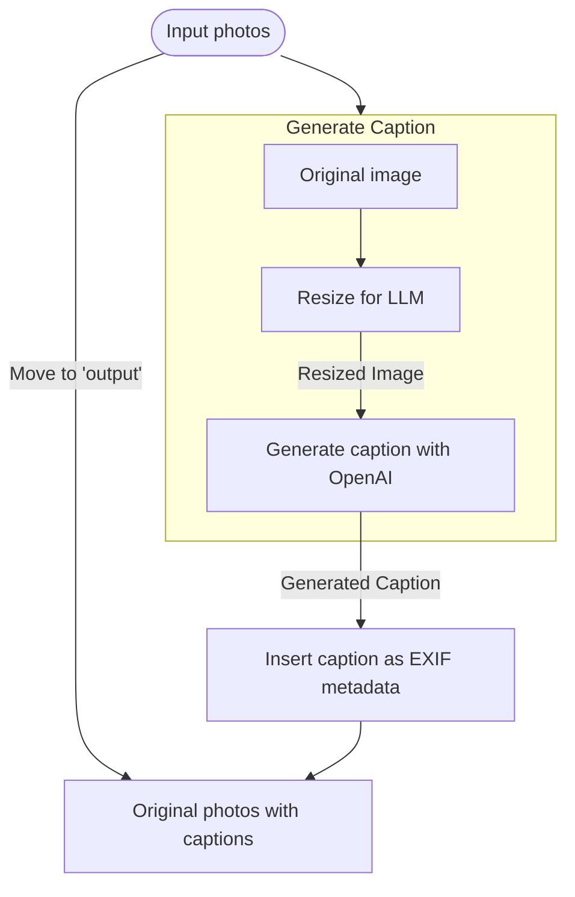

# Candid Captions

Automatically generate captions for your photos using OpenAI's GPT 4.1 Mini
model.

> [!IMPORTANT]
>
> **This code was almost entirely LLM-generated.** It is not intended to be used
> as a reference for good engineering practices. I have reviewed it for accuracy
> and functionality, but not with regard for maintainability. It runs well on my
> machine and is quite useful, but no guarantees are made about it working in
> any other context. It is provided as-is.

## Examples

These are both real-world examples. Neither image had any metadata associated
with it. Both captions are accurate.

| Input image                                                                                                                               | Generated caption                                                                                                                                                       |
| ----------------------------------------------------------------------------------------------------------------------------------------- | ----------------------------------------------------------------------------------------------------------------------------------------------------------------------- |
|  | Yellow 1968 Oldsmobile Cutlass convertible parked on a city street with a brick building and chain-link fence in the background.                                        |
|                                    | View of downtown Austin, Texas at night from the roof of a condo, showing light trails of vehicles on a busy highway near the Lady Bird Lake and Riverside Drive exits. |

## Setup

1. Install dependencies:

```bash
pnpm install
brew install exiftool
```

2. Create a `.env` file with your OpenAI API key:

```bash
cp .env.example .env
# Edit .env and add your OPENAI_API_KEY
```

## Usage

1. Export your JPEG photos to the `input` directory
2. Run the caption script: `pnpm caption`

The script will:

- Find all .jpg files in the `input` folder
- Resize images to ≤1248px while maintaining aspect ratio
- Generate captions using GPT 4.1 Mini
- Save the captions to the image metadata
- Move processed images to the `output` folder
- Create a log file in the `logs` folder



Resized images are used for the caption request, but the output folder contains
your original images with the added captions in the metadata (full resolution).

> [!NOTE]
>
> The cost comes out to an average of $0.00052941 per image. For $1 you can add
> captions to ~1,900 photos.

## Configuration

- `OPENAI_API_KEY`: Your OpenAI API key (required)
- `CONCURRENCY`: Number of images to process in parallel (default: 4)

> [!TIP]
>
> If you have a higher tier account and hundreds or thousands of images, set the
> `CONCURRENCY` ENV var to a higher value. With a Tier 5 API account you should
> be able to use a concurrency value of at least 50 without issue.

## Requirements

- Node.js 22+
- pnpm
- exiftool (for reading/writing image metadata)

## Notes

- Original images are preserved with metadata intact
- Only JPEG files are processed
- Existing captions or keywords in the image metadata are used to inform the
  caption generation
- Images are processed concurrently (default 4 workers)
- Captions are written to Caption-Abstract, Description, and ImageDescription
  EXIF fields
- Processing logs are saved with timestamps and statistics

## License

Copyright © 2025 Corey Ward. Available under the MIT License.
